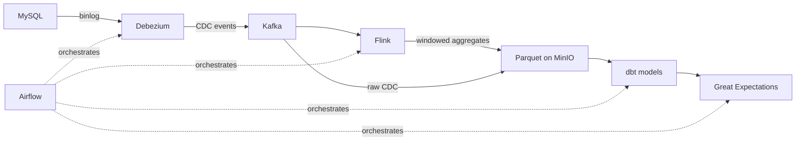

# CDC Pipeline Training — Debezium → Kafka → Flink → Parquet → dbt → Airflow

An 8-week, self-directed training program reproducing a scaled-down, production-style
Change Data Capture (CDC) pipeline: MySQL changes captured by Debezium, streamed
through Kafka, transformed with Apache Flink, landed as partitioned Parquet in MinIO,
modeled and tested with dbt and Great Expectations, and orchestrated end-to-end on
Apache Airflow.

Training plan designed and reviewed by a lead data architect. This repo documents the
build, week by week, including what worked, what broke, and how it was debugged —
not just the final code.

## Architecture

## Progress

| Week | Focus | Checkpoint | Status |
|------|-------|------------|--------|
| [01](./week-01-linux-git-python) | Linux, Git & Python foundations | CLI unaided, 2 PRs merged, script from spec | ⬜ |
| [02](./week-02-python-sql) | Python depth & SQL | JSON/CSV script unaided, dedup query + rationale | ⬜ |
| [03](./week-03-docker-kafka) | Docker & Kafka fundamentals | Multi-container Kafka stack, produce/consume via Python | ⬜ |
| [04](./week-04-debezium-cdc) | Change Data Capture with Debezium | Live insert/update/delete lands as correct Kafka event | ⬜ |
| [05](./week-05-minio-parquet-flink) | Object storage, Parquet & intro Flink | CDC → partitioned Parquet in MinIO; first Flink job runs | ⬜ |
| [06](./week-06-flink-transformations) | Flink streaming transformations | Windowed aggregation, CDC → Flink → Parquet, no manual steps | ⬜ |
| [07](./week-07-dbt-great-expectations) | dbt & Great Expectations | `dbt run` + `dbt test` pass; GE quality gate integrated | ⬜ |
| [08](./week-08-airflow-orchestration) | Airflow orchestration & wrap-up | Full pipeline scheduled, retries configured, live demo | ⬜ |

*(Update the Status column as you go: ⬜ not started → 🟡 in progress → ✅ complete)*

## Stack

Docker & Docker Compose · Python 3 · MySQL · Apache Kafka · Debezium · MinIO ·
PyArrow / Parquet · Apache Flink · dbt-core · Great Expectations · Apache Airflow

## Repo structure

Each `week-XX-*` folder contains:
- A `README.md` — goal, what was built, checkpoint result, and a debug log excerpt
- Code, configs, and scripts for that week
- Screenshots / evidence where useful

See [`docs/debug-log.md`](./docs/debug-log.md) for the full running log of what broke
and why, across all 8 weeks.

## Why this project

Built as hands-on preparation for Data Analyst / MIS + Data Engineering roles, based
on a real production-style CDC architecture. The goal isn't just running the stack —
it's being able to explain every design decision in it.
